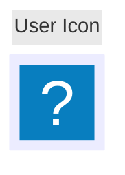
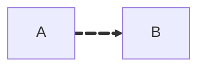
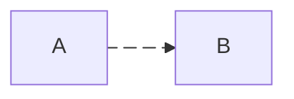

# Mermaid Flowchart Node Shapes and Connecting Lines

## Node Shapes

### Basic Nodes & Labels
- Default node: `id` or `id[Label text]`
- Unicode label: `id["This ❤ Unicode"]`
- Markdown label (usually with `htmlLabels: false`): `id["`This **is** _Markdown_`"]`

### Classic Bracket-Based Shapes
- Rounded rectangle: `id(This is the text in the box)`
- Stadium / pill: `id([This is the text in the box])`
- Subroutine: `id[[This is the text in the box]]`
- Cylinder / database: `id[(Database)]`
- Circle: `id((This is the text in the circle))`
- Double circle: `id(((This is the text in the circle)))`
- Asymmetric shape: `id>This is the text in the box]`
- Diamond / decision (rhombus): `id{This is the text in the box}`
- Hexagon: `id{{This is the text in the box}}`
- Parallelogram: `id[/This is the text in the box/]`
- Parallelogram alt: `id[\This is the text in the box\]`
- Trapezoid: `A[/Christmas\]`
- Trapezoid alt: `B[\Go shopping/]`

### Expanded Shapes (v11.3.0+ `shape` Syntax)
General pattern:

- `A@{ shape: rect }`
- `A@{ shape: rect, label: "This is a process" }`

Selected semantic shapes:
- Process / rectangle: `shape: rect` (`proc`, `process`, `rectangle`)
- Event: `shape: rounded`
- Terminal (stadium): `shape: stadium`
- Subprocess: `shape: subproc` / `fr-rect`
- Database: `shape: cyl` (`database`, `db`)
- Start: `shape: circle` or `shape: sm-circ`
- Stop: `shape: dbl-circ` or `shape: fr-circ`
- Decision: `shape: diam` (`decision`, `diamond`, `question`)
- Prepare / conditional: `shape: hex`
- Input / output: `shape: lean-r` (input/output), `shape: lean-l` (output/input)
- Manual operation: `shape: trap-t`
- Priority action: `shape: trap-b`
- Document: `shape: doc`
- Multi-document: `shape: docs`
- Multi-process: `shape: processes` / `st-rect`
- Direct access storage: `shape: das`
- Disk storage: `shape: lin-cyl`
- Stored data: `shape: bow-rect`
- Internal storage: `shape: win-pane`
- Text block: `shape: text`
- Card: `shape: notch-rect`
- Summary: `shape: cross-circ`
- Collate: `shape: hourglass`
- Fork/join: `shape: fork`
- Paper tape: `shape: flag`
- Loop limit: `shape: notch-pent`

### Icon and Image Shapes

Icon node example:



Image node example:

```mermaid
flowchart TD
    A@{ img: "https://picsum.photos/300", label: "Image Label", pos: "t", w: 60, h: 60, constraint: "on" }
```

Key parameters:
- `icon` / `img`: icon name or image URL
- `form`: background shape (`square`, `circle`, `rounded`)
- `label`: optional text
- `pos`: `t` (top) or `b` (bottom)
- `w`, `h`: width and height
- `constraint`: `"on"` / `"off"` for sizing and aspect ratio

## Connecting Lines & Arrows

### Basic Links
- Directed arrow: `A-->B`
- Open link (no arrow): `A --- B`

### Text on Links
- Inline text: `A-- This is the text! ---B`
- Inline text with arrow: `A-- text -->B`
- Pipe-delimited text: `A---|This is the text|B`, `A-->|text|B`

### Dotted and Thick Links
- Dotted: `A-.->B`
- Dotted with text: `A-. text .-> B`
- Thick: `A ==> B`
- Thick with text: `A == text ==> B`

### Invisible Links
- Layout-only link: `A ~~~ B`

### New Arrow Types
- Circle edge: `A --o B`
- Cross edge: `A --x B`
- Multi-directional combinations: `A o--o B`, `B <--> C`, `C x--x D`

### Chaining and Multi-Node Links
- Chained links: `A -- text --> B -- text2 --> C`
- Multiple sources/targets: `a --> b & c --> d`, `A & B --> C & D`

### Edge IDs and Animation

Assign an ID:


Animate an edge:



Animation presets:



Via classes:


## Gotchas / Warnings
- A node ID of lowercase `end` can break flowcharts; prefer `End`, `END`, etc.
- Node IDs that start with `o` or `x` in connecting nodes may be parsed as circle/cross edges; avoid by inserting a space or capitalizing the first letter.
