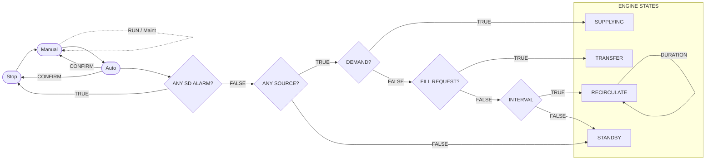

# Current issues
- [x] When `Connect New Node` creates a syntax error once the new node is added. The code currently inserts `    flowchart-REPO --> Test Node` when it should insert `    REPO --> Test Node`
- [x] Remove the `Save As` button from the template.
- [x] When a node is clicked in the right panel, sometimes when I click a node, it it highlighted in red in the left panel. I like this, but it only works with some notes, not all. For example, in the chart below, clicking on `Stop`, `Manual`, `DEMAND?`, `INTERVAL`, `SUPPLYING`, `TRANSFER`, `RECIRCULATE`, and `STANDBY` all selected the correct items. When `Auto`, `ANY SD ALARM?`, and `ANY SOURCE?` are clicked, nothing is highlighted.

# Improvements
- [] Expand the functionality of the right click menu. Add more node shapes and associate them with names related to PLC programs. For example, in my current flowchar. I represent files, folder, databases, repositories, system states, systems, computers, scripts, programs, and departemnts. I would like a shape associated with each of these as well as an extra generic option. Add all of these to the menu, make it a sub-menu please.
- [] Currently, the chart or graph is scaled by the size of the window panel.I would like to be able to zoom in and out, as well as move the chart around when click dragging.